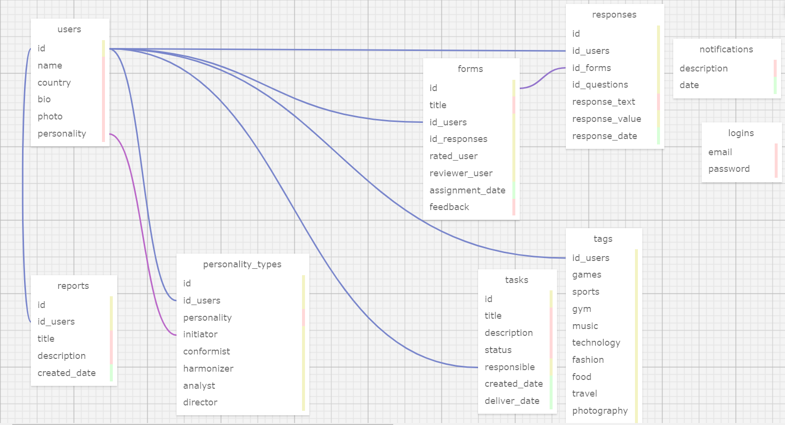

# Ponderada de Programação - Quarta Semana - Segundo Módulo 

Este repositório é dedicado à atividade avaliativa de Modelagem de Banco de Dados, correspondente à quarta semana da segunda sprint do segundo módulo  do [Inteli - Instituto de Tecnologia e Liderança](https://www.inteli.edu.br/). O foco desta atividade é programação. Neste contexto, aceitamos o desafio de desenvolver e apresentar uma proposta de modelo de banco de dados para o nosso projeto utilizando o [SQL Designer](https://github.com/ondras/wwwsqldesigner).

# Modelo Relacional

Nesta seção, apresentamos o **modelo relacional** da nossa aplicação, construído com base na plataforma [SQL toad](https://sql.toad.cz/). Este modelo é uma representação estruturada das entidades e de suas relações, fundamentais para o funcionamento e organização do sistema. As tabelas aqui descritas formam a espinha dorsal da nossa aplicação, delineando como os dados são armazenados, relacionados e acessados. 


<div align="center">
<sub>Figura 01 - Modelo Relacional</sub>
<br>
<br>

<br>
<br>
<sup>Fonte: Material produzido pelos autores (2024)</sup>
</div>

A imagem mostra um esquema de banco de dados criado no [SQL toad](https://sql.toad.cz/), que é uma representação gráfica da estrutura de um banco de dados relacional. Inclui várias tabelas como 'usuários', 'formulários', 'notificações', 'tipos de personalidade', 'relatórios' e 'tags'. Cada tabela é representada por um retângulo contendo uma lista de seus atributos (como id, nome, país, bio para a tabela 'usuários'). As linhas que conectam as tabelas representam relações entre elas; por exemplo, linhas azuis podem indicar restrições de chave estrangeira onde o atributo de uma tabela faz referência à chave primária de outra tabela. Este esquema é relevante, pois organiza visualmente e demonstra como os dados estão interconectados dentro deste banco de dados específico, o que pode ser crucial para entender o fluxo de dados e as relações para qualquer pessoa que precise trabalhar ou gerenciar este banco de dados.

**Descrição Visual do Esquema:**

- **Tabelas e Atributos:** Cada tabela é claramente definida com seus atributos listados, facilitando a identificação das informações que cada uma armazena.
- **Relacionamentos:** As linhas azuis representam as relações de chave estrangeira, essenciais para manter a integridade referencial entre as tabelas.
- **Organização:** O layout organizado do esquema ajuda a visualizar como as tabelas se relacionam umas com as outras e como os dados fluem no sistema.

Este esquema é uma ferramenta valiosa para desenvolvedores e analistas de banco de dados, pois fornece uma visão clara da estrutura do banco de dados e de como as tabelas estão interligadas. É um componente essencial para a documentação e manutenção do banco de dados.

Agora, vamos explorar cada tabela em detalhes:

* **Tabela Usuário:**
    - A tabela Usuário armazena informações sobre os usuários do sistema, incluindo nome (VARCHAR), país (VARCHAR), biografia (TEXT), foto (BLOB), entre outros. Todos os campos são NOT NULL, exceto a foto.
    - A chave estrangeira `personality` (INT, NOT NULL) referencia a tabela `personality_types`, permitindo a associação de tipos de personalidade a cada usuário.

* **Tabela Tags:**
    - A tabela Tags registra tags (VARCHAR, NOT NULL) relacionadas aos interesses e à personalidade dos usuários.
    - A tabela Usuário referencia a tabela Tags por meio da chave estrangeira `id_tags` (INT, NOT NULL), permitindo a associação de tags a cada usuário.

* **Tabela Tasks:**
    - A tabela Tasks armazena informações sobre as tarefas presentes no sistema, como título (VARCHAR, NOT NULL), descrição (TEXT, NOT NULL), status (VARCHAR, NOT NULL), data de criação (DATE, NOT NULL) e data de entrega (DATE).
    - A chave estrangeira `responsible` (INT, NOT NULL) referencia a tabela Usuário, indicando qual usuário é responsável pela execução de cada tarefa.
    - A chave estrangeira `id_columns` (INT, NOT NULL) referencia a tabela Colunas, categorizando as tarefas em diferentes etapas de progresso.

* **Tabela Personality_Types:**
    - A tabela Personality_Types armazena os tipos de personalidade disponíveis para os usuários escolherem (VARCHAR, NOT NULL).
    - A tabela Usuário referencia a tabela Personality_Types por meio da chave estrangeira `personality`, permitindo a associação de tipos de personalidade a cada usuário.

* **Tabela Forms:**
    - A tabela Forms registra informações sobre os formulários preenchidos pelos usuários, como título (VARCHAR, NOT NULL), data de atribuição (DATE, NOT NULL), usuário associado (INT, NOT NULL), avaliador (INT, NOT NULL) e feedback (TEXT).

* **Tabela Reports:**
    - A tabela Reports é usada para registrar relatórios no sistema, que podem ser usados para comunicar imprevistos e situações semelhantes. Ela contém detalhes como descrição (TEXT, NOT NULL), título (VARCHAR, NOT NULL), status (VARCHAR, NOT NULL), data de criação (DATE, NOT NULL) e usuário associado (INT, NOT NULL).

* **Tabela Notifications:**
    - A tabela Notifications registra notificações enviadas aos usuários do sistema, incluindo informações como descrição (TEXT, NOT NULL), data (DATE, NOT NULL), categoria (VARCHAR, NOT NULL) e usuário associado (INT, NOT NULL).

* **Tabela Logins:**
    - A tabela Logins armazena credenciais de acesso dos usuários, como email (VARCHAR, NOT NULL) e senha (VARCHAR, NOT NULL). Essas informações são utilizadas para autenticar os usuários no sistema, garantindo a segurança e a integridade dos dados.

* **Tabela Responses:**
    - A tabela Responses registra as respostas dos usuários a questionários ou avaliações, incluindo informações como perguntas (TEXT, NOT NULL), respostas (TEXT, NOT NULL) e data de resposta (DATE, NOT NULL).
    - A chave estrangeira `id_users` (INT, NOT NULL) associa cada resposta ao usuário correspondente.

# Estrutura do Repositório

Nesta seção, apresentamos a estrutura do repositório e fornecer uma descrição detalhada de cada arquivo e pasta.

```bash
.
├── README.md                # Documentação
├── BancoDeDados             # Pasta contendo os arquivos do banco de dados
│   ├── BancoDeDados.sql     # Banco de dados em SQL
│   └── BancoDeDados.xml     # Banco de dados em XML
└── assets                   # Pastas contendo a imagem do banco de dados 
    └── BancoDeDados.png     # Imagem do banco de dados
```

Detalhes dos Arquivos:

**README.md**: Este arquivo contém a documentação do projeto, incluindo uma descrição detalhada do modelo de banco de dados e suas tabelas.
**BancoDeDados**: Esta pasta contém os arquivos do banco de dados.
**BancoDeDados.sql**: Este arquivo SQL contém os comandos para criar o banco de dados e suas tabelas.
**BancoDeDados.xml**: Este arquivo XML representa a estrutura do banco de dados em um formato que pode ser facilmente importado para outras ferramentas de modelagem de banco de dados.
**assets**: Esta pasta contém recursos visuais relacionados ao projeto.
**BancoDeDados.png**: Esta imagem é uma representação visual do modelo de banco de dados. Ela pode ser útil para entender rapidamente a estrutura e as relações do banco de dados.

Esperamos que esta visão geral da estrutura do repositório ajude você a navegar e entender melhor o projeto. Cada arquivo e pasta tem um propósito específico e contribui para a organização geral e funcionalidade do sistema.

# Regras de Negócio e Solução do Problema

Este modelo de banco de dados foi meticulosamente projetado como uma solução potencial para o desafio apresentado pelo nosso parceiro: reconhecer e compreender as nuances culturais dos colegas no jogo CESIM. Para abordar essa questão complexa, nosso banco de dados foi estruturado para suportar funcionalidades essenciais, como relatórios, tarefas, tags, perfis e formulários.

Por exemplo:
- A tabela `Tags` é utilizada para catalogar as diferenças culturais dos usuários, proporcionando uma compreensão mais profunda das diversas origens e perspectivas presentes no jogo.
- A tabela `Reports` serve como um canal para comunicar imprevistos e outras situações relevantes, promovendo a transparência e a comunicação eficaz entre os jogadores.
- A tabela `Forms` desempenha um papel crucial na coleta de informações sobre a percepção dos usuários em relação a si mesmos e aos seus colegas. Isso é realizado através de avaliações de membros do grupo e autoavaliações, que fornecem insights valiosos e promovem o crescimento pessoal e a compreensão intercultural.

Portanto, nosso modelo de banco de dados não apenas atende às necessidades operacionais do jogo CESIM, mas também se esforça para resolver o problema central de promover a conscientização e a compreensão cultural entre os jogadores.

Desenvolver e apresentar esta proposta de modelo de banco de dados foi uma experiência enriquecedora e fundamental para o nosso aprendizado no módulo. Através desta atividade, pudemos aplicar os conceitos aprendidos em modelagem de banco de dados na prática, compreendendo melhor a importância da organização e estruturação dos dados em um sistema. Além disso, explorar as funcionalidades do SQL Toad nos permitiu familiarizar-nos com uma ferramenta valiosa para o desenvolvimento de bancos de dados relacionais. Este projeto nos desafiou a pensar de forma crítica e criativa, e estamos confiantes de que os conhecimentos adquiridos serão de grande utilidade em nossas futuras atividades profissionais.
